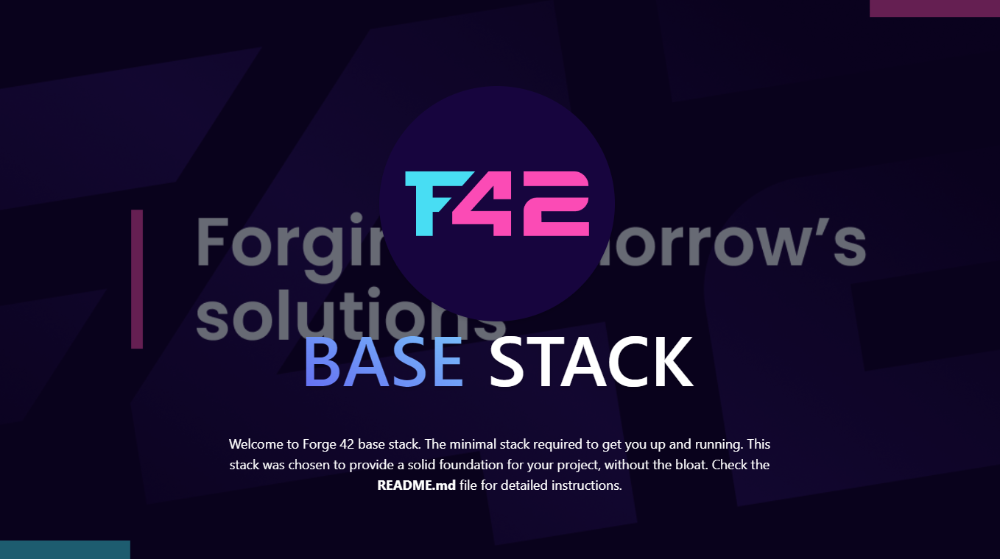

<p align="middle">

</p>

# Welcome to Forge 42 base-stack

This is a base-stack for Forge 42 projects. This stack is a starting point for all Forge 42 stacks with more
advanced features. This is an ESM Vite stack with Remix.run / React Router v7.

It includes a basic setup for a project with react-router v7 framework mode and:
- React 19 & react-compiler
- TypeScript
- TailwindCSS
- Vite
- Vitest (unit tests)
- Scripting
- Biome (linter & formatter)
- i18n support (client and server)
- Icons spritesheet generator
- lefthook hooks
- CI checks for quality control
- react-router-devtools
- Hono server
- .env var handling for server and client
- SEO robots.txt, sitemap-index and sitemap built in.

## Internationalization

This stack uses i18next for internationalization. It supports both client and server side translations.
Features included out of the box:
- Support for multiple languages
- Typesafe resources
- client side translations are fetched only when needed
- language switcher
- language detector (uses the request to detect the language, falls back to your fallback language)

## Hono server

This stack uses Hono for the server. More information about Hono can be found [here](https://honojs.dev/).
Another important thing to note is that we use a dependency called `react-router-hono-server` which is a wrapper for Hono that allows us to use Hono in our React Router application.

The server comes preconfigured with:
- i18next middleware
- caching middleware for assets
- easily extendable global application context
- .env injection into context

In order to add your own middleware, extend the context, or anything along those lines, all you have to do is edit the server
inside the `entry.server.tsx` file.

## .env handling

This stack parses your `.env` file and injects it into the server context. For the client side, in the `root.tsx` file, we use the `useLoaderData` hook to get the `clientEnv` from the server and set it as a global variable on the `window` called `env`.
If you need to access the env variables in both environments, you can create a polyEnv helper like this:
```ts
// app/utils/env.ts
// This will return the process.env on the server and window.env on the client
export const polyEnv = typeof process !== "undefined" ? process.env : window.env;
```
The server will fail at runtime if you don't set your `.env` file properly.

## Getting started

1. Fork the repository

2. Install the dependencies:
```bash
pnpm install
```
3. Read through the README.md files in the project to understand our decisions.

4. Run the cleanup script:
```bash
pnpm cleanup
```

This will remove everything in the project related to the base-stack like README.md etc.
This is the first thing you should run after initializing the project.
After it is run it will remove itself from the package.json.

5. Start the development server:
```bash
pnpm run dev
```
6. Happy coding!
